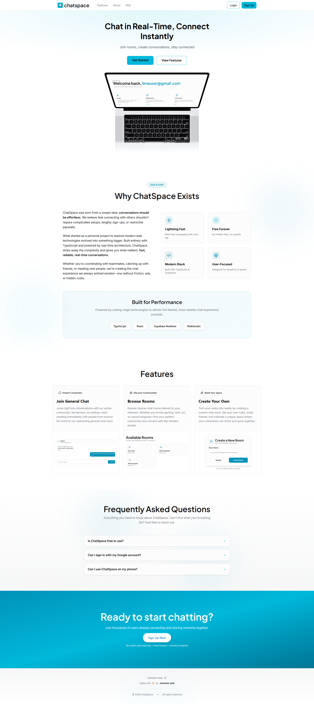
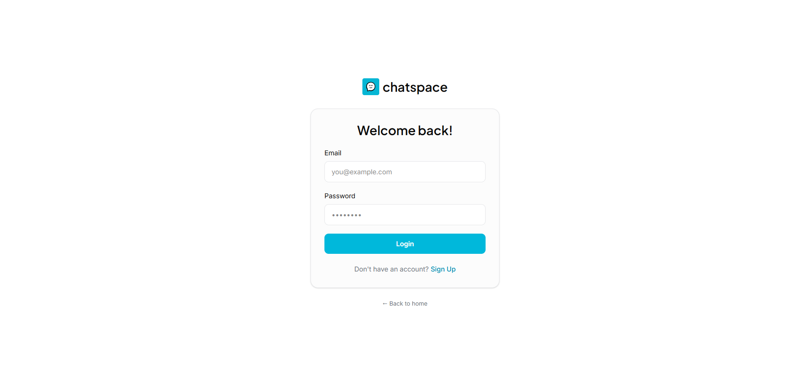
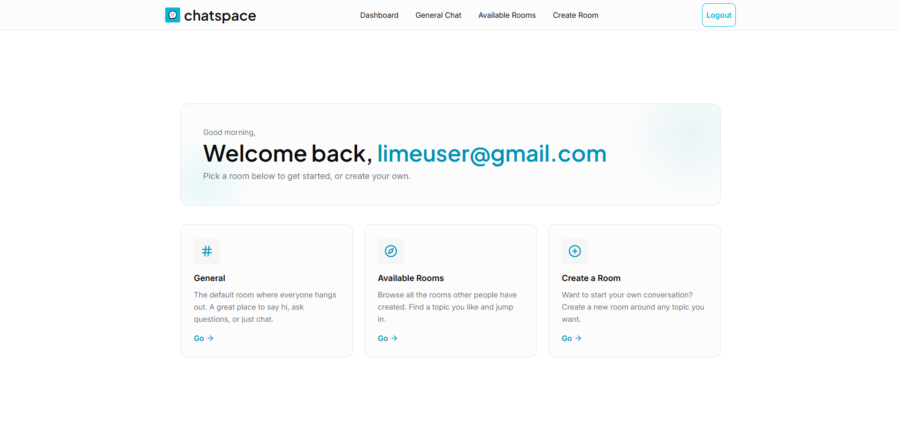
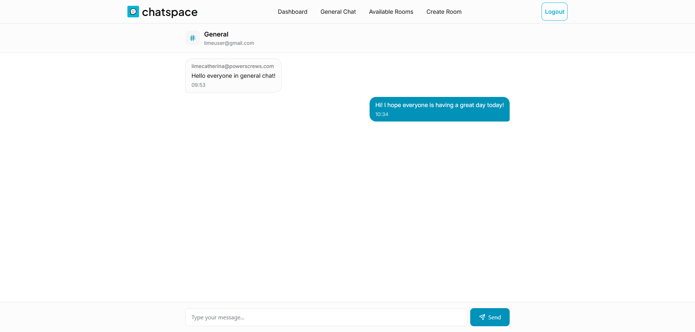
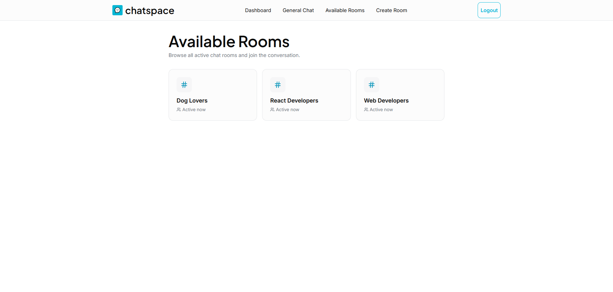
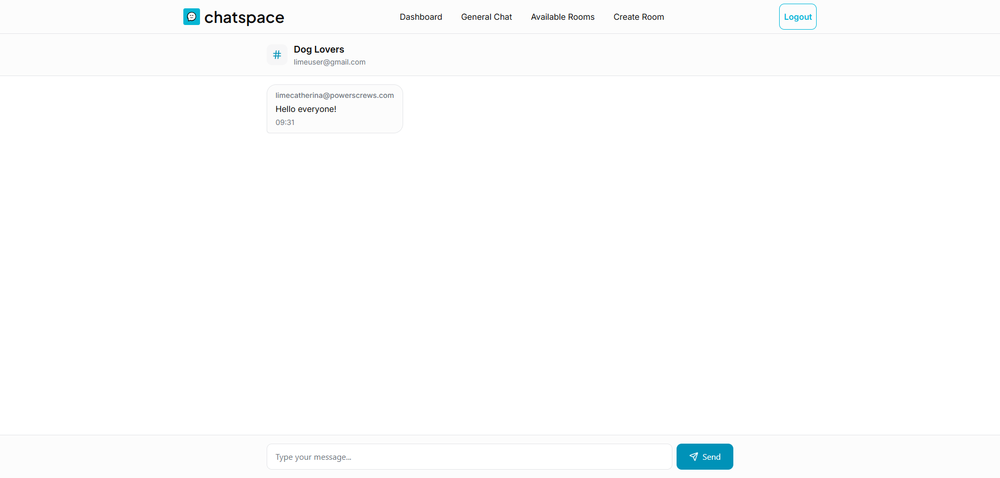
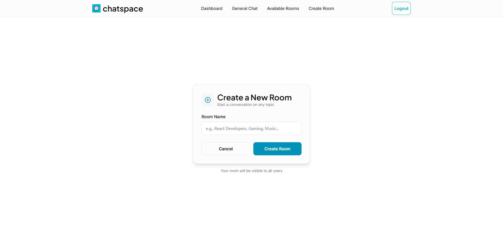

  
  
  # 💬 ChatSpace – Real-Time Chat Application

A modern real-time chat application built as a **portfolio project** to demonstrate front-end engineering skills, real-time data handling, and clean UI/UX practices.

ChatSpace allows users to authenticate, join public chat rooms, create their own rooms, and communicate instantly using Supabase's real-time features.

---

## 🚀 Live Demo

---

## 🧠 Why I Built This

I built this project to:
- Practice building **real-time applications**
- Work with **authentication & protected routes**
- Apply **state management** and **server-state caching** correctly
- Create a **polished, responsive UI** suitable for production apps
- Showcase how different modern tools work together in a real project

This project reflects how I approach real-world frontend problems, not just UI implementation.

---

## 🛠 Tech Stack

### Frontend
- **React + TypeScript**
- **Tailwind CSS** – responsive and utility-first styling
- **Framer Motion** – smooth animations and UI transitions

### State & Data
- **Zustand** – client-side global state management
- **TanStack Query (React Query)** – server state, caching, and async data handling
- **React Hook Form** – form handling and validation

### Routing & Backend
- **React Router** – routing and protected pages
- **Supabase** – authentication, database, and real-time subscriptions

---

## ✨ Features

- Animated landing page with Framer Motion
- Fully responsive design (mobile, tablet, desktop)
- Authentication (Sign Up / Login) using Supabase
- Real-time chat powered by Supabase subscriptions
- User dashboard after login to guide navigation
- General chat room for open conversations
- Join existing public rooms
- Create your own public chat room

---

## 📸 Screenshots

### Landing Page

### Authentication

### Dashboard

### General Chat

### Rooms List

### Room Chat

### Create Room

---

## 🧩 Architecture & Design Decisions

- **Zustand** was used for lightweight global state without boilerplate.
- **React Query** handles server state to avoid unnecessary re-fetching and keep UI in sync.
- **Supabase Realtime** ensures instant message updates across users.
- **React Hook Form** improves UX with validation and clean error handling.
- Separation between UI components, logic, and data fetching for maintainability.

---

## 🧪 What I Learned

- Managing **real-time data** without UI glitches
- Structuring state between client and server correctly
- Handling authentication flows in a real app
- Building scalable component structures
- Improving UX with motion and feedback

---